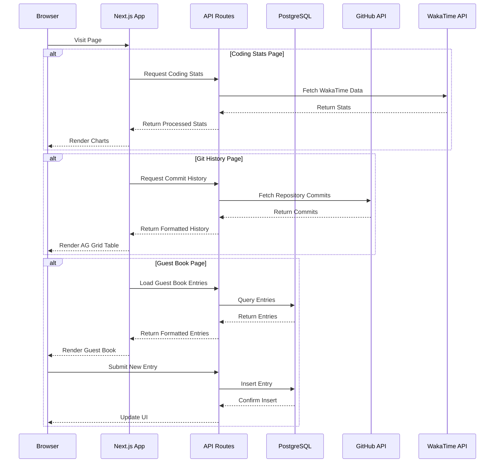

# IDE-Style Portfolio

A modern, interactive portfolio website styled to look and function like a code editor. Built with Next.js 14, TypeScript, and Tailwind CSS.

[Live Demo](https://patrickcarter.dev)


## Features

### 🎨 IDE-Inspired Design

- File tree navigation in the sidebar
- Tabbed interface for seamless content switching
- Syntax-highlighted file icons
- Status bar with useful information
- Dark theme optimized for developers

### ⚡ Interactive Elements

- **Boot Screen**: Custom loading animation on first visit
- **File Navigation**: Click files in the tree to open them in tabs
- **Tab Management**:
  - Open multiple sections simultaneously
  - Close tabs individually
  - Tabs persist across navigation
  - Active tab syncs with current route

### 📱 Responsive Design

- Adapts seamlessly from mobile to desktop
- Collapsible sidebar on mobile
- Optimized layout for all screen sizes

### 📊 Dynamic Features

- **Coding Stats**: Real-time WakaTime integration showing coding activity
- **Guest Book**: Interactive visitor comments section with GitHub authentication
- **Last Updated**: Automatic timestamp of latest site updates
- **Contact Terminal**: Command-line style contact form

### 🔧 Technical Highlights

- Server and Client Components optimized for performance
- Built with Next.js 14 App Router
- TypeScript for type safety
- Tailwind CSS for styling
- Clerk Authentication
- Prisma ORM with PostgreSQL
- Deployed on Vercel

## Local Development

1. Clone the repository:
   \`\`\`bash
   git clone https://github.com/yourusername/portfolio.git
   cd portfolio
   \`\`\`

2. Install dependencies:
   \`\`\`bash
   npm install
   \`\`\`

3. Set up environment variables:
   \`\`\`bash

# Create a .env file with the following variables (replace with your values)

DATABASE_URL="your_database_url"
NEXT_PUBLIC_CLERK_PUBLISHABLE_KEY="your_clerk_publishable_key"
CLERK_SECRET_KEY="your_clerk_secret_key"
\`\`\`

4. Run the development server:
   \`\`\`bash
   npm run dev
   \`\`\`

5. Open [http://localhost:3000](http://localhost:3000) in your browser.

## Project Structure

```bash
src/
├── app/ # Next.js 14 app directory and pages
│ ├── api/ # API routes
│ ├── (routes)/ # App routes and pages
│ └── layout.tsx # Root layout
├── components/ # React components
│ ├── Background/ # Background effects
│ ├── IDE/ # IDE-style UI components
│ └── Terminal/ # Terminal interface
├── contexts/ # React context providers
├── lib/ # Utility functions and shared logic
├── store/ # State management
└── types/ # TypeScript type definitions
```

## Key Components

### IDE Layout

- **Sidebar**: File tree navigation
- **Tabs**: Multi-tab content management
- **Footer**: Status bar with links and info

### Interactive Features

- **Boot Screen**: Appears on first visit with loading animation
- **Terminal**: Command-line style contact interface
- **Guest Book**: Visitor comments with authentication

## Deployment

The site is configured for deployment on Vercel with the following features:

- Automatic deployments on push to main
- Environment variable management
- Edge functions for optimal performance
- PostgreSQL database integration

## Credits

- Design inspiration: [wiscaksono.com](https://wiscaksono.com/)
- Icons: Lucide React, React Icons
- UI Components: Custom implementation with Tailwind CSS

## License

MIT License - feel free to use this for your own portfolio!

---

[Visit Live Site](https://patrickcarter.dev) | [GitHub](https://github.com/xCarter93)

## Architecture

```mermaid
flowchart TB
    Client[Client Browser]
    Next[Next.js 15 App Router]
    Server[Server Actions]
    DB[(Postgres DB)]
    GH[GitHub API]
    WK[WakaTime API]
    Clerk[Clerk Auth]

    Client --> Next
    Next --> Server
    Server --> DB
    Server --> GH
    Server --> WK
    Client --> Clerk
    Clerk --> Next

    subgraph Frontend
        Next --> Pages[Pages]
        Next --> Components[Components]
        Components --> IDE[IDE Components]
        Components --> Charts[Data Visualization]
        Components --> UI[UI Components]
        Components --> Background[Dynamic Background]
        Background --> Sun[Sun/Moon System]
        Background --> Particles[Particle Effects]
    end

    subgraph State Management
        Components --> Zustand[Zustand Store]
        Components --> Context[React Context]
    end

    subgraph Data Sources
        DB --> GuestBook[Guest Book Entries]
        GH --> GitHistory[Commit History]
        WK --> CodingStats[Coding Statistics]
    end

    style Frontend fill:#2d2d2d,stroke:#1e1e1e
    style State Management fill:#2d2d2d,stroke:#1e1e1e
    style Data Sources fill:#2d2d2d,stroke:#1e1e1e
```



## API Flow



## Features

- VS Code-themed UI with working tabs and navigation
- Interactive components mimicking IDE functionality
- Real-time coding statistics visualization
- Git commit history tracking
- Guest book functionality
- Responsive design
- Dark mode optimized

## Tech Stack

- Next.js 14 (App Router)
- TypeScript
- Tailwind CSS
- Zustand
- AG Grid
- Chart.js
- PostgreSQL
- Prisma ORM

## Getting Started

1. Clone the repository
2. Install dependencies: `npm install`
3. Set up environment variables (see `.env.example`)
4. Run the development server: `npm run dev`
5. Open [http://localhost:3000](http://localhost:3000)

## Environment Variables

Create a `.env.local` file with the following variables:

```env
POSTGRES_URL=
POSTGRES_PRISMA_URL=
POSTGRES_URL_NO_SSL=
POSTGRES_URL_NON_POOLING=
POSTGRES_USER=
POSTGRES_HOST=
POSTGRES_PASSWORD=
POSTGRES_DATABASE=
GITHUB_PAT=
```

## Deployment

The application is deployed on Vercel and uses Vercel Postgres for the database.
